# Conversational Chatbot for ATAI 2025 @ UZH

<div align="center">
  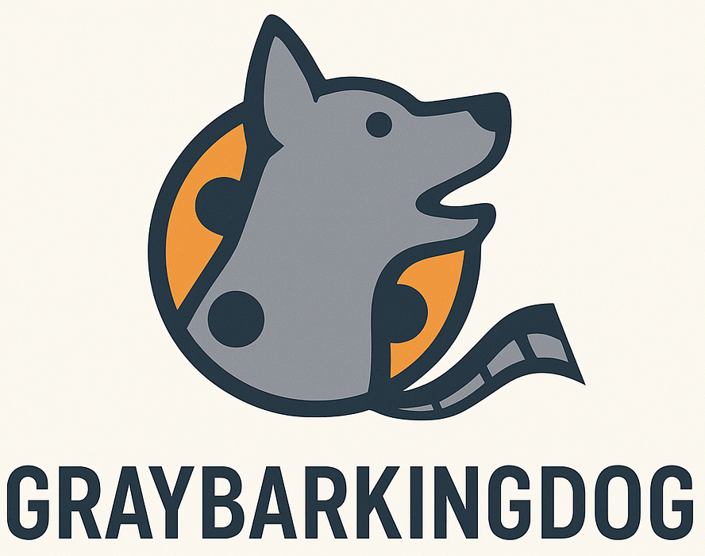
</div>

A sophisticated conversational chatbot that can answer questions using a knowledge graph through multiple approaches: direct SPARQL queries, natural language question answering, movie recommendations, and multimedia retrieval.

## Overview

The chatbot supports four main modes of operation:

1. **SPARQL Mode**: Direct querying of the RDF knowledge graph
2. **QA Mode**: Natural language question answering with entity extraction and answer generation
   - **Factual Submode**: Traditional QA with entity extraction, SPARQL query execution, and direct knowledge graph lookups
   - **Embedding Submode**: Embedding-based similarity search using entity and relation embeddings to find the most likely answer
3. **Recommendation Mode**: Hybrid movie recommendation system combining content-based (TF-IDF) and collaborative filtering approaches
   - **Content-Based (TF-IDF)**: Recommends movies similar in content (genres, directors, themes) with hybrid scoring using common traits
   - **Collaborative Filtering**: Recommends movies based on user rating patterns (movies liked by users with similar tastes)
   - **Graph Fallback**: When both models fail, traverses the KG around the mentioned titles to return directly connected films (shared cast, director, etc.)
4. **Multimedia Mode**: Image retrieval and multimedia content handling

The system uses a modular architecture with local LLM models, embedding-based entity matching, and intelligent fallback mechanisms for robust question answering.

## Project Structure

```
atai-chatbot/
├── app/
│   ├── core.py                    # Main application class
│   ├── entity_extractor.py        # Shared entity extraction module
│   ├── qa_handler.py              # Question answering with entity extraction
│   ├── kg_handler.py              # Knowledge graph and SPARQL handling
│   ├── recommender.py             # Movie recommendation system
│   ├── multimedia_handler.py      # Image and multimedia retrieval
│   └── llm/                       # Local LLM framework
│       ├── llama_cpp_handler.py   # GGUF model support
│       ├── transformer_handler.py # Hugging Face models
│       ├── json_parser.py         # JSON extraction
│       └── prompt_manager.py      # Prompt management
│
├── dataset/                       # Knowledge graph and embeddings
├── models/                        # Local model cache
├── testing/                       # Test suite
├── config.py                      # Configuration settings
└── main.py                        # Application entry point
```


## Installation

1. **Clone the repository:**
    ```bash
    git clone <repository-url>
    cd atai-chatbot
    ```

2. **Install dependencies:**
   ```bash
   pip install -r requirements.txt
   ```
   
   **For GPU acceleration:**
   ```bash
   CMAKE_ARGS="-DLLAMA_CUBLAS=on" FORCE_CMAKE=1 pip install llama-cpp-python --upgrade --force-reinstall --no-cache-dir
   ```
   
   **Install spaCy English model (required for NER):**
   ```bash
   python -m spacy download en_core_web_trf
   ```

3. **Set up environment:**
   Create a `.env` file with your Speakeasy credentials:
    ```
    SPEAKEASY_USERNAME=<your-username>
    SPEAKEASY_PASSWORD=<your-password>
    ```

4. **Configure the system:**
   Edit `config.py` to set your preferred mode and settings.

    To create the Pickled graph binary use the `dataset/create_pickle_binary.py` file. This may take 2 minutes, since the whole graph has to be loaded.
## Usage

**Run the chatbot:**
```bash
python main.py
```

**Available modes:**
- `1`: SPARQL queries
- `2`: Natural language QA (with factual/embedding submode detection)
- `3`: Movie recommendations (hybrid content-based + collaborative filtering)
- `4`: Multimedia retrieval (image lookup for films and persons)
- `5`: Auto-detect mode (with submode detection)

**Example questions:**
- SPARQL: `SELECT * WHERE { ?s ?p ?o } LIMIT 5`
- QA Factual: `Who directed The Godfather?` or `Please answer this question with a factual approach: Who directed The Godfather?`
- QA Embedding: `Please answer this question with an embedding approach: Who directed The Godfather?`
- Recommendations: `I like The Godfather, can you recommend something similar?` or `Recommend movies like The Matrix and Inception`
- Multimedia: `Show me a picture of Halle Berry` or `What does Denzel Washington look like?`

## Key Components

### Entity Extractor (entity_extractor.py)
Shared module providing sophisticated entity extraction capabilities used by both QA Handler and Recommender. The `EntityExtractor` class implements a unified extraction pipeline with multiple fallback strategies.

#### Initialization
The `EntityExtractor` requires:
- `kg_handler`: LocalKnowledgeGraph instance for entity lookups
- `nlp`: spaCy language model for NER
- `property_names`: List of property names to filter out from entity matches
- `ent2lbl`: Dictionary mapping entity URIs to labels (optional, for `find_entities_by_label()`)
- `all_entity_labels`: List of all entity labels (optional, for `find_entities_by_label()`)

Automatically loads and caches entity labels from the knowledge graph to `app/cached_entities.json` on initialization.

#### Unified Extraction Method
The `extract_entities(question, use_fuzzy_match=False, fuzzy_cutoff=0.7)` method combines all extraction strategies in a prioritized order:
1. **Pattern-based extraction** for difficult entities (quoted titles, colons, special characters)
2. **NER extraction** using spaCy (only adds non-overlapping entities)
3. **Fuzzy matching** (optional, controlled by `use_fuzzy_match` parameter) for misspelled or variant entities
4. **Brute force fallback** (called separately when `extract_entities()` returns no results)

Returns a list of entity dictionaries with `'text'` and `'label'` keys.

#### Extraction Strategies

- **Difficult Entity Extraction** (`extract_difficult_entities()`): Pattern-based extraction for complex entities with:
  - Quoted strings (single, double, and Unicode curly quotes: `'`, `"`, `'`, `"`)
  - Titles with colons and dashes (e.g., "Star Wars: Episode IV", "X-Men: First Class")
  - Complex titles with multiple special characters
  - Handles edge cases like "The Lord of the Rings: The Fellowship of the Ring"
  - Specific patterns for Star Wars, X-Men, Chronicles of Narnia, and other complex franchises
  - Movies with numbers and special characters (e.g., "12 Monkeys", "300: Rise of an Empire")

- **NER Extraction** (`ner_entity_extraction()`): spaCy-based named entity recognition that identifies standard entity types (PERSON, ORG, WORK_OF_ART, etc.). Only adds entities that don't overlap with difficult entities already extracted.

- **Fuzzy Matching** (`fuzzy_match_extract_entities(question, cutoff=0.7, max_matches_per_mention=1)`, optional): 
  - Two-stage process: first extracts potential entity mentions using heuristics, then matches them
  - **Mention Extraction** (`_extract_potential_entity_mentions()`): Uses heuristics to identify likely entity names:
    - Capitalized phrases (sequences of capitalized words)
    - Quoted strings (all quote types)
    - Phrases after entity-indicating words (movie, film, show, actor, director, etc.)
  - Uses rapidfuzz library for fast fuzzy string matching
  - Configurable similarity threshold (cutoff, default 0.7, converted to 0-100 scale for rapidfuzz)
  - Uses weighted ratio (WRatio) for initial matching and token sort ratio for validation
  - Filters out property names and very short mentions (< 3 characters)
  - Handles misspellings and variations in entity names

- **Brute Force Fallback** (`brute_force_extract_entities()`): 
  - Last resort method when other extraction methods fail
  - Searches through all cached entity labels sorted by length (longest first)
  - Uses `_find_entity_with_word_boundaries()` for flexible matching:
    - Simple entities: Uses word boundaries (`\b`) for exact matching
    - Complex entities: Flexible regex patterns that handle punctuation variations (colons, em-dashes, hyphens)
    - Preserves original case from user input
  - Implements `_select_entities_by_longest_match()` strategy:
    - Prioritizes longer, more specific entity matches
    - Safety check: Prefers exact case matches when both lowercase and proper case versions exist
  - Filters out property names automatically

- **Entity Label Matching** (`find_entities_by_label(label, top_k=5, get_close_matches_n=1, get_close_matches_cutoff=0.6)`): 
  - Uses difflib for finding closest matching entity labels
  - Returns top-k matching entity URIs as tuples: `[(entity_uri, entity_label), ...]`
  - Requires embeddings lookup dictionaries (`ent2lbl`, `all_entity_labels`)
  - Useful for embedding-based QA submode and entity resolution in recommender

#### Cached Entity Management
- Automatically loads and caches entity labels from the knowledge graph to `app/cached_entities.json`
- First run queries the knowledge graph via `kg_handler.get_all_entities()`; subsequent runs use cached data
- Eliminates redundant queries and speeds up entity matching significantly
- Cache is stored as a JSON list of entity label strings

#### Features
- **Word Boundary Handling**: Flexible matching via `_find_entity_with_word_boundaries()` that handles:
  - Simple entities: Standard word boundaries
  - Complex entities: Flexible patterns for punctuation variations (colons `:`, em-dashes `–`, hyphens `-`)
- **Longest Match Strategy**: Prioritizes longer, more specific entity matches over shorter ones (via `_select_entities_by_longest_match()`)
- **Case Preservation**: Maintains original case from user input when possible
- **Property Filtering**: Automatically filters out property names from entity matches (uses `property_names` list)
- **Deduplication**: Prevents duplicate entities across different extraction methods (case-insensitive checks)
- **Overlap Prevention**: NER entities are only added if they don't overlap with difficult entities already found

The EntityExtractor consolidates all entity extraction logic, ensuring consistent behavior across different handlers and eliminating code duplication.

### QA Handler
Sophisticated question answering with two distinct submodes:

#### Entity Extraction Pipeline
Both submodes use the shared EntityExtractor module for entity extraction:
- **Entity Extraction**: Uses EntityExtractor to identify entities in questions
- **Property Mapping**: Synonym-based property identification with fuzzy string matching (QA-specific)
- **Entity-Property Pairing**: Matches extracted entities with relevant properties for query construction

#### Factual Submode
- **Approach**: Direct knowledge graph querying via SPARQL
- **Process**: After entity and property extraction, executes SPARQL queries to retrieve exact answers
- **Use Case**: Questions requiring precise, factual answers from the knowledge graph
- **Output**: Direct extraction from RDF triples

#### Embedding Submode
- **Approach**: Embedding-based similarity search
- **Process**: 
  1. Retrieves entity embedding for the extracted entity
  2. Retrieves relation embedding for the identified property
  3. Computes `entity_embedding + relation_embedding` to form query embedding
  4. Finds the most similar entity using pairwise distance comparison
- **Use Case**: Questions where semantic similarity can help find related entities
- **Output**: Most likely answer entity based on embedding similarity

#### Answer Formatting
Both submodes use LLM-powered natural language formatting to generate human-readable responses from the raw results.

### Recommendation Handler
Sophisticated hybrid movie recommendation system that combines two complementary approaches:

#### Entity Extraction and Common Traits Inference
The recommendation pipeline starts with the shared EntityExtractor for entity extraction:
- **Entity Extraction**: Uses EntityExtractor (with all fallback strategies) to identify movie titles from user queries
- **Entity Resolution**: 
  1. Maps movie titles to all candidate Wikidata URIs using exact and fuzzy label matching (`resolve_entity_to_candidates`)
  2. Returns nested list structure: `[[uri1, uri2], [uri3], ...]` where each inner list contains all candidate URIs for one entity
  3. Filters candidates to only film entities using film class checking (`filter_candidates`)
- **Common Traits Inference**: Recursively explores the knowledge graph to find shared properties (directors, genres, actors, themes) across user's liked movies
- **Trait Aggregation**: Identifies the most common traits with source tracking and count-based ranking

#### Content-Based Recommendations (TF-IDF with Hybrid Scoring)
- **Approach**: TF-IDF vectorization of movie metadata (genres, directors, year, types, descriptions)
- **Initialization**: Metadata DataFrame and TF-IDF matrix are built during `MovieRecommender` initialization
- **Process**:
  1. Metadata DataFrame is built for all movies in the ratings dataset (with caching)
  2. TF-IDF matrix is created from combined movie features ("soup")
  3. Cosine similarity matrix is computed between all movies
  4. **Hybrid Scoring**: Boosts recommendations that match common traits identified from user's preferences
  5. Uses trait labels to create weighted query vectors for enhanced similarity matching
- **Use Case**: Finding movies with similar content, themes, or creative elements
- **Output**: Movies ranked by content similarity with trait-based boosting

#### Collaborative Filtering Recommendations
- **Approach**: Item-based collaborative filtering using user rating patterns
- **Initialization**: User-item matrix and item-item similarity matrix are built during `MovieRecommender` initialization
- **Process**:
  1. User-item rating matrix is built from ratings dataset, with missing values (unrated items) filled using average item ratings from `item_ratings.csv` instead of zeros. If an item is not found in `item_ratings.csv`, the global mean rating across all items is used as a fallback
  2. Item-item similarity is computed based on how users rate movies
  3. Finds movies similar to user's liked movies based on rating patterns
  4. Recommends movies that users with similar tastes have rated highly
- **Use Case**: Discovering movies through collective user preferences and rating patterns
- **Output**: Movies ranked by collaborative similarity scores

#### Knowledge Graph Fallback Recommendations
- **Trigger**: Executed only when both TF-IDF and collaborative filtering return empty results (e.g., movies missing from metadata or sparse ratings)
- **Approach**: `get_fallback_movies()` walks MOVIE_PROPS in the KG, collecting other films that connect to the selected URIs through shared cast members, directors, writers, genres, production companies, or home countries
- **Filtering**: Keeps only entities explicitly typed as films (`wd:Q11424`), de-duplicates by URI, and caps the list (default 10 items) to avoid overwhelming responses
- **Formatting**: `format_fallback_recommendations()` uses a dedicated prompt when the LLM is available and gracefully falls back to a plain text list if generation fails
- **Purpose**: Guarantees the user still receives useful, explainable suggestions even if either model cannot score the requested titles

#### Recommendation Formatting
- **LLM-Powered Formatting**: Uses dedicated prompt to format both recommendation types into natural language
- **Structured Output**: Presents content-based and collaborative filtering recommendations separately with clear explanations
- **Fallback**: Simple text formatting if LLM is unavailable
- **Response Format**: Explains the difference between the two recommendation types and lists movies from both approaches

#### Initialization
- **Model Building**: Metadata DataFrame, TF-IDF matrix, and collaborative filtering models are built during `MovieRecommender` object initialization
- **Caching**: Metadata fetching uses caching for performance - first initialization may take time, but cached data speeds up subsequent initializations
- **Performance**: All models are ready immediately after initialization, making recommendation calls fast and consistent

### Multimedia Handler
Sophisticated image retrieval system that maps natural language queries to image paths for films and persons.

#### Entity Extraction and Type Detection
The multimedia pipeline starts with the shared EntityExtractor for entity extraction:
- **Entity Extraction**: Uses EntityExtractor (with fuzzy matching and brute force fallback) to identify entity names from user queries
- **Entity Type Detection**: Uses `is_film()` and `is_person()` methods to determine entity type:
  - **Film Detection**: Checks if entity is instance of film classes (Q11424: film, Q202866: animated film, Q24856: film series)
  - **Person Detection**: Checks if entity is instance of human class (Q5: human)
- **Entity Resolution**: Maps entity labels to entity URIs using EntityExtractor's `find_entities_by_label()` method

#### On-Demand Image Search
- **Simple Approach**: No precomputed cache - searches `images.json` in-memory for each query
- **Query Flow**:
  1. Extract multiple entity candidates from question using EntityExtractor (with fuzzy matching and brute force fallback)
  2. Filter candidates to only films or persons using `is_film()` or `is_person()`
  3. **Loop through entity results** until a valid image is found:
     - For each entity, query knowledge graph for IMDb ID using `graph.objects(entity_uri, WDT.P345)`
     - If no IMDb ID found, continue to next entity
     - If IMDb ID found, search `images.json` for entries where IMDb ID matches:
       - **For Films**: IMDb ID must be in the `movie` list
       - **For Persons**: IMDb ID must be in the `cast` list AND `type` must be `"profile"`
     - If images found, return immediately with the first valid image path
     - If no images found, continue to next entity
  4. If no valid image found after checking all entities, return an apology message
- **In-Memory Data**: `images.json` is loaded during initialization and kept in memory for fast searches
- **Response Format**: Returns image path in format `image:{path}` (e.g., `image:0227/rm73963776.jpg`) or an apology message if no valid image is found
- **Image Selection**: The `get_image()` method accepts a `return_random_image` parameter (default: `False`) to control whether to return a random image or the first matching image
- **Error Handling**: Loops through all entity candidates to maximize chances of finding a valid image. Returns helpful apology message only if no valid image is found after checking all entities

#### Initialization
- **Entity Labels**: Loads entity labels from knowledge graph for EntityExtractor initialization
- **Images Data**: Loads `images.json` into memory during initialization
- **No Cache Building**: No cache file needed - searches are performed on in-memory data
- **Performance**: Initialization loads `images.json` (may take time for large files), but all queries are fast with in-memory data

### Local LLM Framework
Modular framework supporting:
- **GGUF Models**: Local LLM inference with llama-cpp-python
- **Transformer Models**: NER and embedding models via Hugging Face
- **JSON Parsing**: Robust extraction of structured data from LLM responses
- **Resource Management**: Automatic model loading/unloading with context managers

## Testing

### Running Factual Tests
Test factual question answering with different test cases covering directors, actors, genres, and release dates:

```bash
python -m unittest testing.test_factual_embeddings
```

### Running SPARQL Tests
Test direct SPARQL query functionality with different evaluation queries:

```bash
python -m unittest testing.test_sparql
```

## Architecture Diagrams

### High-Level Chat Loop Architecture (main.py)

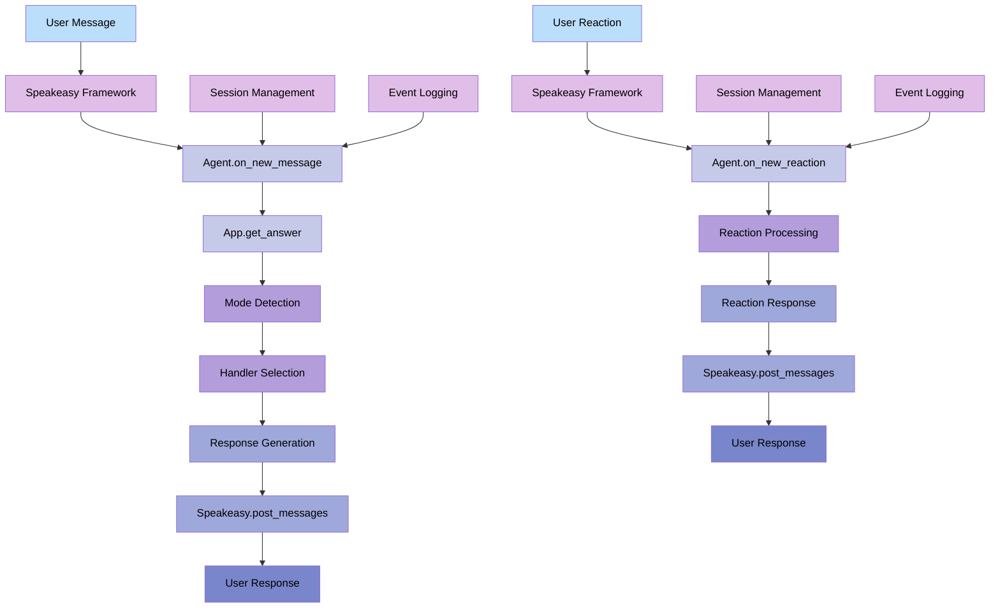

### High-Level App Core Architecture (core.py)

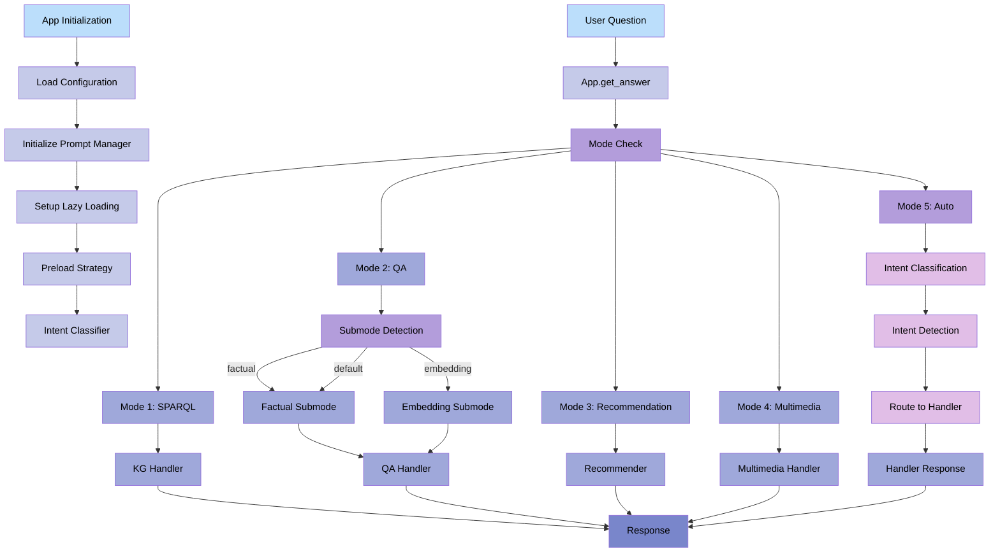

### High-Level Knowledge Graph Handler (kg_handler.py)

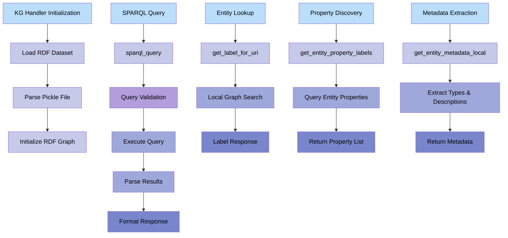

### LLM Usage in Intent Classification (core.py)

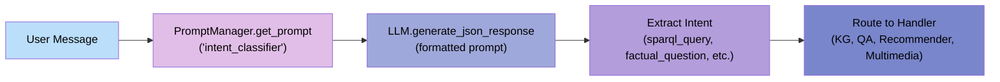

### QA Handler Pipeline (qa_handler.py)

```mermaid
flowchart LR
    A["User Question"] --> B["Entity Extraction<br>(EntityExtractor)"]
    B --> C["NER Extraction"] & D["Difficult Entities Pattern Matching"]
    C --> E["Collect Potential Entity-Property Candidates"]
    D --> E
    E --> F{"Candidates Found?"}
    F -- No --> G["Brute Force Entity and Property Extraction Fallback"]
    F -- Yes --> H["Select Best Entity"]
    G --> I{"Candidates Found?"}
    I -- No --> J["No Entities Error"]
    I -- Yes --> H
    H --> K{"Submode?"}
    K -- Factual --> L["Factual: Execute SPARQL Query"]
    K -- Embedding --> M["Compute Query Embedding<br>entity + relation"]
    L --> N["Retrieve Answer from KG"]
    M --> O["Find Most Similar Entity<br>Pairwise Distance"]
    N --> P["Format Answer with LLM"]
    O --> P
    P --> Q["Natural Language Response"]

    style A fill:#FFE0B2,color:#000000
    style B fill:#FFCC80,color:#000000
    style C fill:#FFCC80,color:#000000
    style D fill:#FFCC80,color:#000000
    style E fill:#A5D6A7,color:#000000
    style F fill:#FFAB91,color:#000000
    style G fill:#FFCC80,color:#000000
    style H fill:#A5D6A7,color:#000000
    style I fill:#FFAB91,color:#000000
    style J fill:#EF9A9A,color:#000000
    style K fill:#CE93D8,color:#000000
    style L fill:#90CAF9,color:#000000
    style M fill:#90CAF9,color:#000000
    style N fill:#90CAF9,color:#000000
    style O fill:#90CAF9,color:#000000
    style P fill:#CE93D8,color:#000000
    style Q fill:#81C784,color:#000000
```

### LLM Usage in QA Answer Formatting (qa_handler.py - format_answer)

```mermaid
graph LR
    A["SPARQL/Embedding Results<br>(List of Dicts)"] --> B{"Results<br>Error?"}
    B -- Yes --> C["Return Error Message"]
    B -- No --> D["Extract Answers<br>(answerLabel or answerItem)"]
    D --> E{"Answers<br>Found?"}
    E -- No --> F["Return No Answer Message"]
    E -- Yes --> G["Remove Duplicates<br>(Preserve Order)"]
    G --> H["Prepare Raw Data Dict<br>(answers, answers_count,<br>question_entity_metadata)"]
    I["User Question"] --> H
    H --> J["PromptManager.get_prompt<br>('qa_formatter')"]
    J --> K["LLM.generate_response<br>(formatted prompt)"]
    K --> L{"Response<br>Success?"}
    L -- No --> M["Simple Fallback<br>Formatting<br>(Join answers)"]
    L -- Yes --> N{"Submode?"}
    N -- Factual --> O["Return: 'Based on my<br>knowledge graph: ' + content"]
    N -- Embedding --> P{"Single Answer<br>Found?"}
    P -- Yes --> Q["Get Type from KG<br>(P31 property)"]
    Q --> R["Return: 'Based on my<br>embeddings: ' + content + type"]
    P -- No --> S["Return: 'Based on my<br>embeddings: ' + content"]
    
    style A fill:#90CAF9,color:#000000
    style B fill:#FFAB91,color:#000000
    style C fill:#EF9A9A,color:#000000
    style D fill:#A5D6A7,color:#000000
    style E fill:#FFAB91,color:#000000
    style F fill:#EF9A9A,color:#000000
    style G fill:#A5D6A7,color:#000000
    style H fill:#A5D6A7,color:#000000
    style I fill:#FFE0B2,color:#000000
    style J fill:#CE93D8,color:#000000
    style K fill:#90CAF9,color:#000000
    style L fill:#FFAB91,color:#000000
    style M fill:#FFF9C4,color:#000000
    style N fill:#FFAB91,color:#000000
    style O fill:#81C784,color:#000000
    style P fill:#FFAB91,color:#000000
    style Q fill:#90CAF9,color:#000000
    style R fill:#81C784,color:#000000
    style S fill:#81C784,color:#000000
```

### Recommendation Handler Pipeline (recommender.py)

```mermaid
flowchart LR
    A["User Query"] --> B1["Entity Extraction<br>(EntityExtractor)"]
    B1 --> B2["Filter to Films<br>(filter_candidates)"]
    B2 --> C["Infer Common Traits<br>(KG exploration)"]
    
    C --> D1["Lookup Movie URIs<br>in Metadata DF"]
    D1 --> D2["Extract Features<br>(genres, directors,<br>year, types, desc)"]
    D2 --> D3["Compute Cosine<br>Similarity"]
    C --> D4["Build Trait Query<br>Vector"]
    D4 --> D5["Trait-Based<br>Score Boosting"]
    D3 --> D5
    D5 --> D["TF-IDF Recommendations"]
    
    C --> E["CF Recommendations<br>(Rating Patterns)"]
    D --> H{"TF-IDF/CF Results?"}
    E --> H
    H -- Yes --> F["Format with LLM (Prompt: recommendation_formatter)"]
    H -- No --> I["Fallback to KG Recommendations"]
    I --> J["Format with LLM (Prompt: fallback_recommendation_formatter)"]
    F --> G["Natural Language<br>Response"]
    J --> G
    
    style A fill:#FFE0B2,color:#000000
    style B1 fill:#FFCC80,color:#000000
    style B2 fill:#FFCC80,color:#000000
    style C fill:#A5D6A7,color:#000000
    style D1 fill:#90CAF9,color:#000000
    style D2 fill:#90CAF9,color:#000000
    style D3 fill:#90CAF9,color:#000000
    style D4 fill:#90CAF9,color:#000000
    style D5 fill:#90CAF9,color:#000000
    style D fill:#90CAF9,color:#000000
    style E fill:#90CAF9,color:#000000
    style H fill:#FFAB91,color:#000000
    style I fill:#90CAF9,color:#000000
    style J fill:#CE93D8,color:#000000
    style F fill:#CE93D8,color:#000000
    style G fill:#81C784,color:#000000
```

### LLM Usage in Normal Recommendations (recommender.py - format_recommendations)

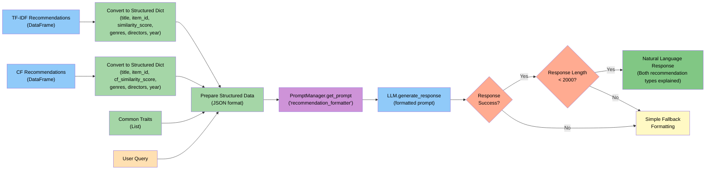

### LLM Usage in Fallback Recommendations (recommender.py - format_fallback_recommendations)

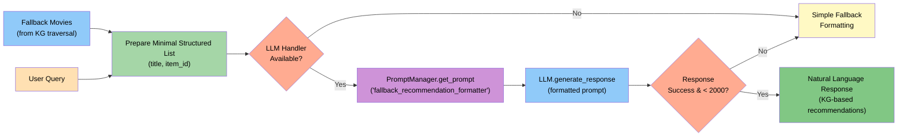

### Multimedia Handler Pipeline (multimedia_handler.py)

```mermaid
flowchart LR
    A["User Query"] --> B["Entity Extraction<br>(EntityExtractor)"]
    B --> C["Filter to Films/Persons<br>(is_film or is_person)"]
    C --> D{"Entity Results<br>Found?"}
    D -- No --> E["Error: Entity not found"]
    D -- Yes --> F["Loop: For Each Entity"]
    F --> G["Get IMDb ID from KG<br>(graph.objects P345)"]
    G --> H{"IMDb ID<br>Found?"}
    H -- No --> I["Continue to<br>Next Entity"]
    H -- Yes --> J["Search images.json<br>for IMDb ID"]
    J --> K{"Entity Type?"}
    K -- Film --> L["Search in movie list"]
    K -- Person --> M["Search in cast list<br>(type=profile)"]
    L --> N{"Images<br>Found?"}
    M --> N
    N -- No --> I
    N -- Yes --> O["Get First Image Path"]
    O --> P["Return: image:{path}"]
    I --> Q{"More Entities<br>to Check?"}
    Q -- Yes --> F
    Q -- No --> R["Return: Apology Message"]
    
    style A fill:#FFE0B2,color:#000000
    style B fill:#FFCC80,color:#000000
    style C fill:#A5D6A7,color:#000000
    style D fill:#FFAB91,color:#000000
    style E fill:#EF9A9A,color:#000000
    style F fill:#90CAF9,color:#000000
    style G fill:#90CAF9,color:#000000
    style H fill:#FFAB91,color:#000000
    style I fill:#FFF9C4,color:#000000
    style J fill:#90CAF9,color:#000000
    style K fill:#FFAB91,color:#000000
    style L fill:#90CAF9,color:#000000
    style M fill:#90CAF9,color:#000000
    style N fill:#FFAB91,color:#000000
    style O fill:#90CAF9,color:#000000
    style P fill:#81C784,color:#000000
    style Q fill:#FFAB91,color:#000000
    style R fill:#EF9A9A,color:#000000
```

---
