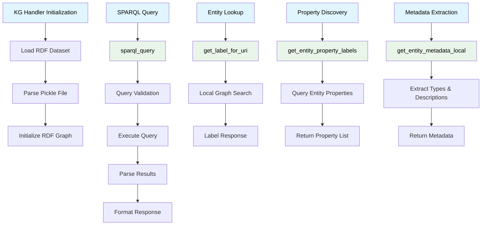
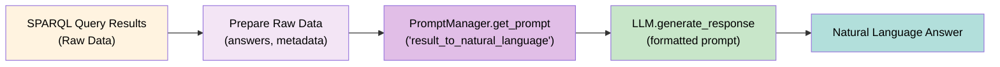
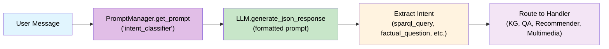
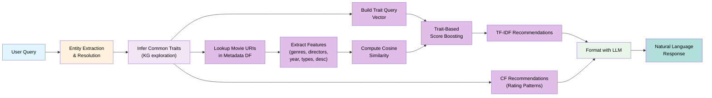
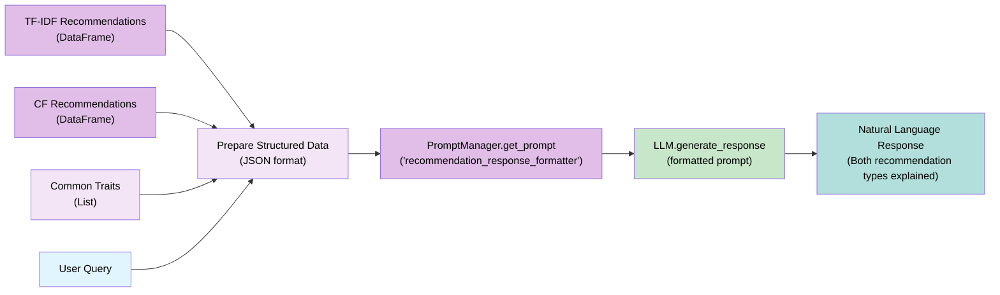

# Conversational Chatbot for ATAI 2025 @ UZH

<div align="center">
  
</div>

A sophisticated conversational chatbot that can answer questions using a knowledge graph through multiple approaches: direct SPARQL queries, natural language question answering, movie recommendations, and multimedia retrieval.

## Overview

The chatbot supports four main modes of operation:

1. **SPARQL Mode**: Direct querying of the RDF knowledge graph
2. **QA Mode**: Natural language question answering with entity extraction and answer generation
   - **Factual Submode**: Traditional QA with entity extraction, SPARQL query execution, and direct knowledge graph lookups
   - **Embedding Submode**: Embedding-based similarity search using entity and relation embeddings to find the most likely answer
3. **Recommendation Mode**: Hybrid movie recommendation system combining content-based (TF-IDF) and collaborative filtering approaches
   - **Content-Based (TF-IDF)**: Recommends movies similar in content (genres, directors, themes) with hybrid scoring using common traits
   - **Collaborative Filtering**: Recommends movies based on user rating patterns (movies liked by users with similar tastes)
4. **Multimedia Mode**: Image retrieval and multimedia content handling

The system uses a modular architecture with local LLM models, embedding-based entity matching, and intelligent fallback mechanisms for robust question answering.

## Project Structure

```
atai-chatbot/
├── app/
│   ├── core.py                    # Main application class
│   ├── qa_handler.py              # Question answering with entity extraction
│   ├── kg_handler.py              # Knowledge graph and SPARQL handling
│   ├── recommender.py             # Movie recommendation system
│   ├── multimedia_handler.py      # Image and multimedia retrieval
│   └── llm/                       # Local LLM framework
│       ├── llama_cpp_handler.py   # GGUF model support
│       ├── transformer_handler.py # Hugging Face models
│       ├── json_parser.py         # JSON extraction
│       └── prompt_manager.py      # Prompt management
│
├── dataset/                       # Knowledge graph and embeddings
├── models/                        # Local model cache
├── testing/                       # Test suite
├── config.py                      # Configuration settings
└── main.py                        # Application entry point
```


## Installation

1. **Clone the repository:**
    ```bash
    git clone <repository-url>
    cd atai-chatbot
    ```

2. **Install dependencies:**
   ```bash
   pip install -r requirements.txt
   ```
   
   **For GPU acceleration:**
   ```bash
   CMAKE_ARGS="-DLLAMA_CUBLAS=on" FORCE_CMAKE=1 pip install llama-cpp-python --upgrade --force-reinstall --no-cache-dir
   ```
   
   **Install spaCy English model (required for NER):**
   ```bash
   python -m spacy download en_core_web_trf
   ```

3. **Set up environment:**
   Create a `.env` file with your Speakeasy credentials:
    ```
    SPEAKEASY_USERNAME=<your-username>
    SPEAKEASY_PASSWORD=<your-password>
    ```

4. **Configure the system:**
   Edit `config.py` to set your preferred mode and settings.

    To create the Pickled graph binary use the `dataset/create_pickle_binary.py` file. This may take 2 minutes, since the whole graph has to be loaded.
## Usage

**Run the chatbot:**
```bash
python main.py
```

**Available modes:**
- `1`: SPARQL queries
- `2`: Natural language QA (with factual/embedding submode detection)
- `3`: Movie recommendations (hybrid content-based + collaborative filtering)
- `4`: Multimedia retrieval (WIP)
- `5`: Auto-detect mode (with submode detection)

**Example questions:**
- SPARQL: `SELECT * WHERE { ?s ?p ?o } LIMIT 5`
- QA Factual: `Who directed The Godfather?` or `Please answer this question with a factual approach: Who directed The Godfather?`
- QA Embedding: `Please answer this question with an embedding approach: Who directed The Godfather?`
- Recommendations: `I like The Godfather, can you recommend something similar?` or `Recommend movies like The Matrix and Inception`
- Multimedia: `Show me a picture of The Godfather`

## Key Components

### QA Handler
Sophisticated question answering with two distinct submodes:

#### Entity Extraction Pipeline (Shared)
Both submodes use the same sophisticated entity extraction pipeline:
- **Difficult Entity Extraction**: Pattern-based extraction for complex entities (quoted titles, colons, special characters)
- **NER Extraction**: spaCy-based named entity recognition
- **Entity Matching**: Fuzzy matching with longest-match strategy and word boundary handling
- **Property Mapping**: Synonym-based property identification with fuzzy string matching
- **Brute Force Fallback**: Comprehensive fallback when initial extraction fails

#### Factual Submode
- **Approach**: Direct knowledge graph querying via SPARQL
- **Process**: After entity and property extraction, executes SPARQL queries to retrieve exact answers
- **Use Case**: Questions requiring precise, factual answers from the knowledge graph
- **Output**: Direct extraction from RDF triples

#### Embedding Submode
- **Approach**: Embedding-based similarity search
- **Process**: 
  1. Retrieves entity embedding for the extracted entity
  2. Retrieves relation embedding for the identified property
  3. Computes `entity_embedding + relation_embedding` to form query embedding
  4. Finds the most similar entity using pairwise distance comparison
- **Use Case**: Questions where semantic similarity can help find related entities
- **Output**: Most likely answer entity based on embedding similarity

#### Answer Formatting
Both submodes use LLM-powered natural language formatting to generate human-readable responses from the raw results.

### Recommendation Handler
Sophisticated hybrid movie recommendation system that combines two complementary approaches:

#### Entity Extraction and Common Traits Inference
The recommendation pipeline starts with the same entity extraction used in QA:
- **Entity Extraction**: Uses NER and pattern matching to identify movie titles from user queries
- **Entity Resolution**: Maps movie titles to Wikidata URIs using fuzzy matching and film class filtering
- **Common Traits Inference**: Recursively explores the knowledge graph to find shared properties (directors, genres, actors, themes) across user's liked movies
- **Trait Aggregation**: Identifies the most common traits with source tracking and count-based ranking

#### Content-Based Recommendations (TF-IDF with Hybrid Scoring)
- **Approach**: TF-IDF vectorization of movie metadata (genres, directors, year, types, descriptions)
- **Initialization**: Metadata DataFrame and TF-IDF matrix are built during `MovieRecommender` initialization
- **Process**:
  1. Metadata DataFrame is built for all movies in the ratings dataset (with caching)
  2. TF-IDF matrix is created from combined movie features ("soup")
  3. Cosine similarity matrix is computed between all movies
  4. **Hybrid Scoring**: Boosts recommendations that match common traits identified from user's preferences
  5. Uses trait labels to create weighted query vectors for enhanced similarity matching
- **Use Case**: Finding movies with similar content, themes, or creative elements
- **Output**: Movies ranked by content similarity with trait-based boosting

#### Collaborative Filtering Recommendations
- **Approach**: Item-based collaborative filtering using user rating patterns
- **Initialization**: User-item matrix and item-item similarity matrix are built during `MovieRecommender` initialization
- **Process**:
  1. User-item rating matrix is built from ratings dataset, with missing values (unrated items) filled using average item ratings from `item_ratings.csv` instead of zeros. If an item is not found in `item_ratings.csv`, the global mean rating across all items is used as a fallback
  2. Item-item similarity is computed based on how users rate movies
  3. Finds movies similar to user's liked movies based on rating patterns
  4. Recommends movies that users with similar tastes have rated highly
- **Use Case**: Discovering movies through collective user preferences and rating patterns
- **Output**: Movies ranked by collaborative similarity scores

#### Recommendation Formatting
- **LLM-Powered Formatting**: Uses dedicated prompt to format both recommendation types into natural language
- **Structured Output**: Presents content-based and collaborative filtering recommendations separately with clear explanations
- **Fallback**: Simple text formatting if LLM is unavailable
- **Response Format**: Explains the difference between the two recommendation types and lists movies from both approaches

#### Initialization
- **Model Building**: Metadata DataFrame, TF-IDF matrix, and collaborative filtering models are built during `MovieRecommender` object initialization
- **Caching**: Metadata fetching uses caching for performance - first initialization may take time, but cached data speeds up subsequent initializations
- **Performance**: All models are ready immediately after initialization, making recommendation calls fast and consistent

### Local LLM Framework
Modular framework supporting:
- **GGUF Models**: Local LLM inference with llama-cpp-python
- **Transformer Models**: NER and embedding models via Hugging Face
- **JSON Parsing**: Robust extraction of structured data from LLM responses
- **Resource Management**: Automatic model loading/unloading with context managers

## Testing

### Running Factual Tests
Test factual question answering with different test cases covering directors, actors, genres, and release dates:

```bash
python -m unittest testing.test_factual_embeddings
```

### Running SPARQL Tests
Test direct SPARQL query functionality with different evaluation queries:

```bash
python -m unittest testing.test_sparql
```

## Architecture Diagrams

### High-Level Chat Loop Architecture (main.py)


### High-Level App Core Architecture (core.py)


### High-Level Knowledge Graph Handler (kg_handler.py)



### QA Handler Pipeline (qa_handler.py)

```mermaid
flowchart LR
    C["Extract Entities"] --> D["NER Extraction"] & E["Difficult Entities Pattern Matching"]
    E --> I["Collect Potential Entity-Property Candidates"]
    I --> J{"Candidates Found?"}
    J -- No --> K@{ label: "<span style=\"background-color:\">Brute Force Entity and Property Extraction Fallback</span>" }
    J -- Yes --> L["Select Best Entity"]
    P{"Candidates Found?"} -- No --> Q["No Entities Error"]
    P -- Yes --> L
    L --> R{"Submode?"}
    R -- Factual --> S["Factual: Execute SPARQL Query"]
    R -- Embedding --> W["Compute Query Embedding<br>entity + relation"]
    S --> U["Retrieve Answer from KG"]
    W --> X["Find Most Similar Entity<br>Pairwise Distance"]
    U --> Y["Format Answer with LLM"]
    X --> Y
    Y --> Z["Natural Language Response"]
    K --> P
    A["User Question"] --> C
    D --> I

    K@{ shape: rect}
    style C fill:#fff3e0,color:#000000
    style D fill:#fff3e0,color:#000000
    style E fill:#fff3e0,color:#000000
    style I fill:#f3e5f5,color:#000000
    style J fill:#fce4ec,color:#000000
    style K fill:#ffebee,color:#000000
    style L fill:#f3e5f5,color:#000000
    style Q fill:#ffcdd2,color:#000000
    style R fill:#e1bee7,color:#000000
    style S fill:#c8e6c9,color:#000000
    style W fill:#c8e6c9,color:#000000
    style U fill:#c8e6c9,color:#000000
    style X fill:#c8e6c9,color:#000000
    style Y fill:#e8f5e8,color:#000000
    style Z fill:#b2dfdb,color:#000000
    style A fill:#e1f5fe,color:#000000
```



### LLM Usage in Factual QA (qa_handler.py)



### LLM Usage in Intent Classification (core.py)



### Recommendation Handler Pipeline (recommender.py)



### LLM Usage in Recommendations (recommender.py)



---