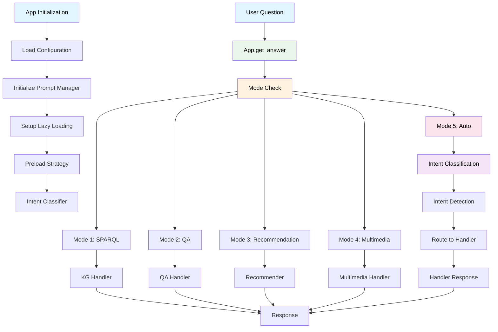

# Conversational Chatbot for ATAI 2025 @ UZH

A sophisticated conversational chatbot that can answer questions using a knowledge graph through multiple approaches: direct SPARQL queries, natural language question answering, movie recommendations, and multimedia retrieval.

## Overview

The chatbot supports four main modes of operation:

1. **SPARQL Mode**: Direct querying of the RDF knowledge graph
2. **QA Mode**: Natural language question answering with entity extraction and SPARQL generation
   - **Factual Submode**: Traditional QA with entity extraction and SPARQL queries
   - **Embedding Submode**: Embedding-based similarity search for entity matching
3. **Recommendation Mode**: Movie recommendations based on user preferences
4. **Multimedia Mode**: Image retrieval and multimedia content handling

The system uses a modular architecture with local LLM models, embedding-based entity matching, and intelligent fallback mechanisms for robust question answering.

## Project Structure

```
atai-chatbot/
├── app/
│   ├── core.py                    # Main application class
│   ├── qa_handler.py              # Question answering with entity extraction
│   ├── kg_handler.py              # Knowledge graph and SPARQL handling
│   ├── recommender.py             # Movie recommendation system
│   ├── multimedia_handler.py      # Image and multimedia retrieval
│   └── llm/                       # Local LLM framework
│       ├── llama_cpp_handler.py   # GGUF model support
│       ├── transformer_handler.py # Hugging Face models
│       ├── json_parser.py         # JSON extraction
│       └── prompt_manager.py      # Prompt management
│
├── dataset/                       # Knowledge graph and embeddings
├── models/                        # Local model cache
├── testing/                       # Test suite
├── config.py                      # Configuration settings
└── main.py                        # Application entry point
```


## Installation

1. **Clone the repository:**
    ```bash
    git clone <repository-url>
    cd atai-chatbot
    ```

2. **Install dependencies:**
   ```bash
   pip install -r requirements.txt
   ```
   
   **For GPU acceleration:**
   ```bash
   CMAKE_ARGS="-DLLAMA_CUBLAS=on" FORCE_CMAKE=1 pip install llama-cpp-python --upgrade --force-reinstall --no-cache-dir
   ```
   
   **Install spaCy English model (required for NER):**
   ```bash
   python -m spacy download en_core_web_trf
   ```

3. **Set up environment:**
   Create a `.env` file with your Speakeasy credentials:
    ```
    SPEAKEASY_USERNAME=<your-username>
    SPEAKEASY_PASSWORD=<your-password>
    ```

4. **Configure the system:**
   Edit `config.py` to set your preferred mode and settings.

## Usage

**Run the chatbot:**
```bash
python main.py
```

**Available modes:**
- `1`: SPARQL queries
- `2`: Natural language QA (with factual/embedding submode detection)
- `3`: Movie recommendations  
- `4`: Multimedia retrieval
- `5`: Auto-detect mode (with submode detection)

**Example questions:**
- SPARQL: `SELECT * WHERE { ?s ?p ?o } LIMIT 5`
- QA Factual: `Who directed The Godfather?`
- Recommendations: `Recommend movies like The Godfather`
- Multimedia: `Show me a picture of The Godfather`

## Key Components

### QA Handler
Sophisticated question answering with two submodes:
- **Factual Submode**: Traditional QA with entity extraction and SPARQL queries
  - **Entity Extraction**: NER-based entity identification with fuzzy matching fallback
  - **Property Mapping**: Synonym-based property identification with fuzzy string matching  
  - **SPARQL Generation**: Automatic query construction from natural language
- **Embedding Submode**: Embedding-based search for answer to question
- **Answer Formatting**: LLM-powered natural language response generation

### Local LLM Framework
Modular framework supporting:
- **GGUF Models**: Local LLM inference with llama-cpp-python
- **Transformer Models**: NER and embedding models via Hugging Face
- **JSON Parsing**: Robust extraction of structured data from LLM responses
- **Resource Management**: Automatic model loading/unloading with context managers

## Testing

### Running Factual Tests
Test factual question answering with different test cases covering directors, actors, genres, and release dates:

```bash
python -m unittest testing.test_factual_embeddings
```

### Running SPARQL Tests
Test direct SPARQL query functionality with different evaluation queries:

```bash
python -m unittest testing.test_sparql
```

## Architecture Diagrams

### High-Level Chat Loop Architecture (main.py)


### High-Level App Core Architecture (core.py)



### High-Level Knowledge Graph Handler (kg_handler.py)


### QA Handler Pipeline (qa_handler.py)

```mermaid
graph LR
    A[User Question] --> B[NER Extraction]
    A --> C[Difficult Entities]
    
    B --> D[Collect Potential Entities]
    C --> D
    
    D --> E[Collect Potential Entity-Based Properties]
    
    E --> F[Candidates Found?]
    
    F -->|No| G[Brute Force Fallback]
    F -->|Yes| H[Select Best Entity]
    
    G --> I[Entities Found?]
    I -->|No| J[No Entities Error]
    I -->|Yes| H
    
    H --> K[Execute SPARQL Query]
    K --> L[Format Answer with LLM]
    L --> M[Natural Language Response]
    
    style A fill:#e1f5fe,color:#000000
    style B fill:#fff3e0,color:#000000
    style C fill:#fff3e0,color:#000000
    style D fill:#e8f5e8,color:#000000
    style E fill:#f3e5f5,color:#000000
    style F fill:#fce4ec,color:#000000
    style I fill:#fce4ec,color:#000000
    style H fill:#f3e5f5,color:#000000
    style L fill:#e8f5e8,color:#000000
    style J fill:#ffebee,color:#000000
```



---